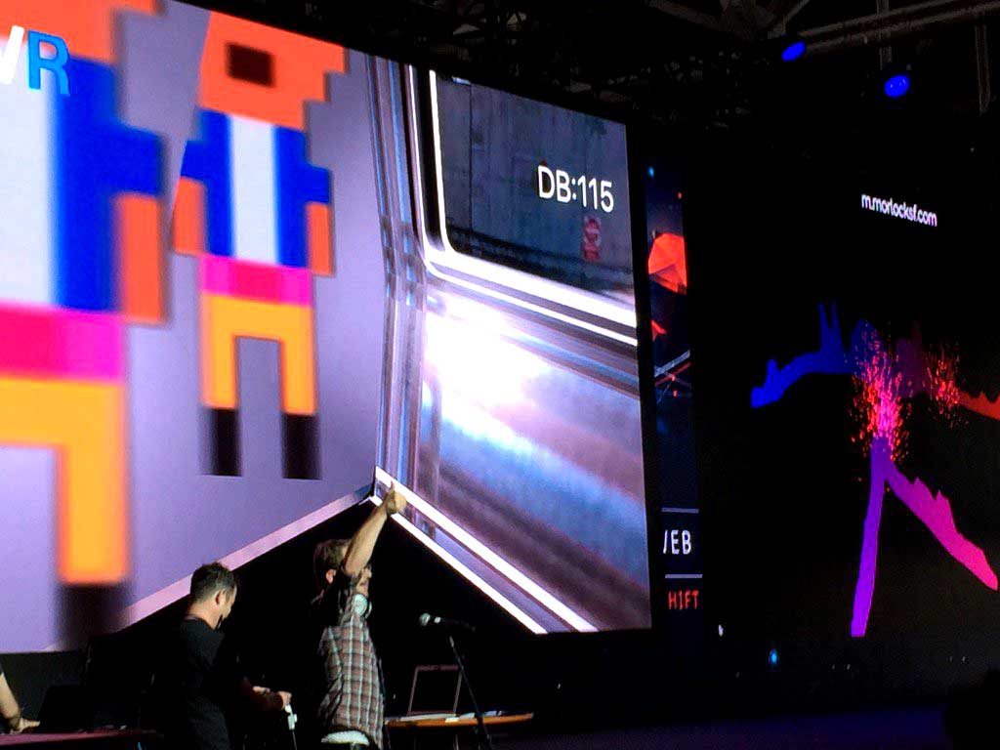

ds.bartVR
(DemoScene).bartVR
=============
<pre>
 ____   __   ____  ____  _  _  ____ 
(  _ \ / _\ (  _ \(_  _)/ )( \(  _ \
 ) _ (/    \ )   /  )(  \ \/ / )   /
(____/\_/\_/(__\_) (__)  \__/ (__\_)
                                                                                                                                                                                     
</pre>

<a href="http://www.3dwebfest.com/">3dwebfest </a> -> bartVR Client Application to setup place your https://firebaseio.com/ url in /SF-Underground-final/rider/app/app.js | ionic serve 

Author: <a href="mailto:brendonsmith@seacloud9.org"> BrendonSmith@seacloud9.org</a> | <a href="http://seacloud9.org">SeaCloud9</a>

**TODO:**
* refactor all firebase code to be more reuseable
* refactor all camera code

